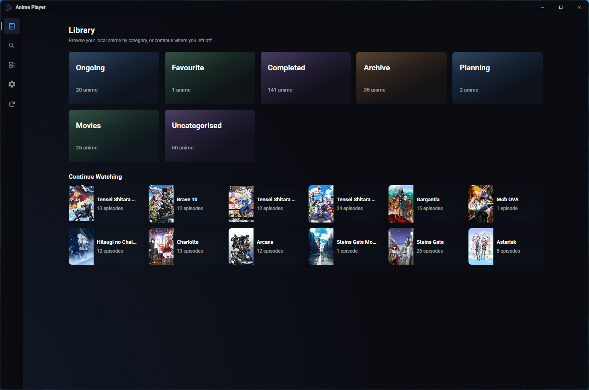
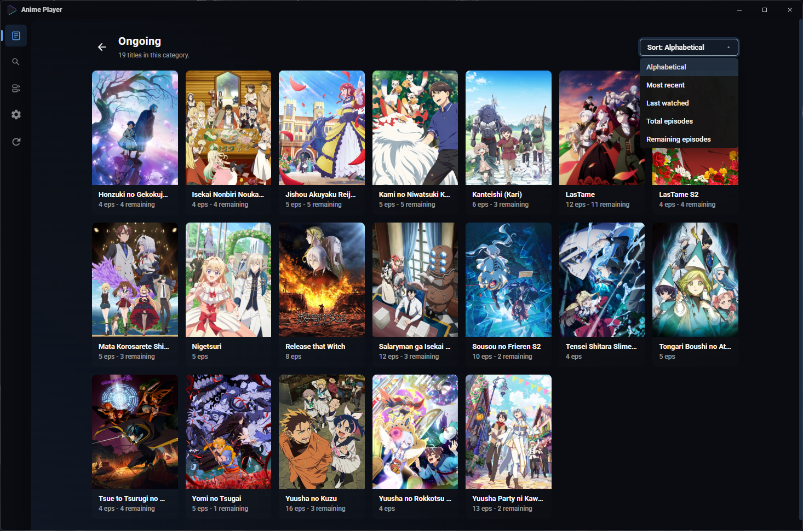
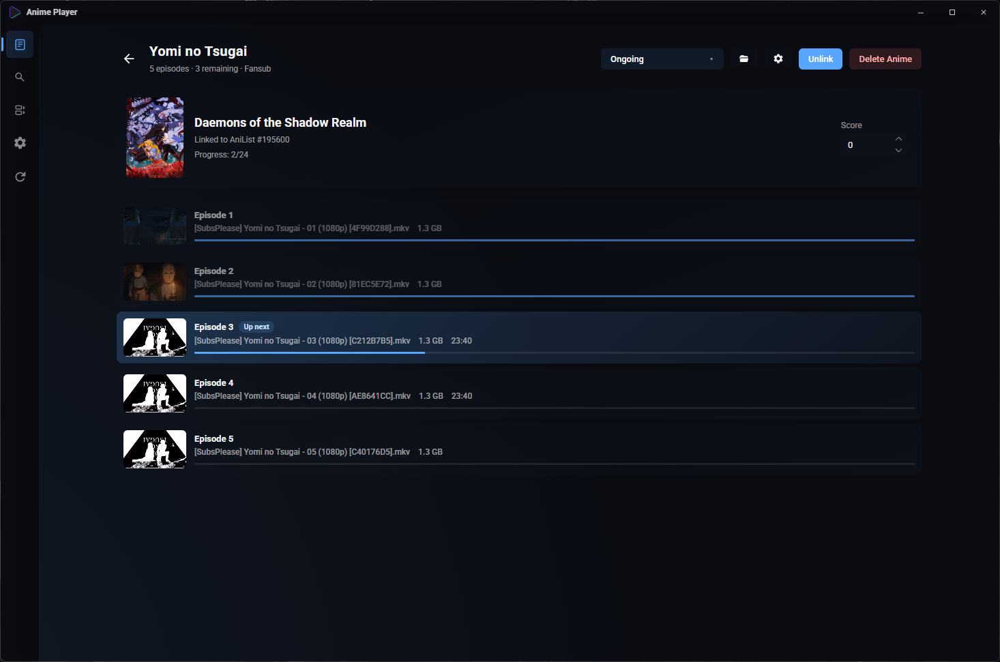
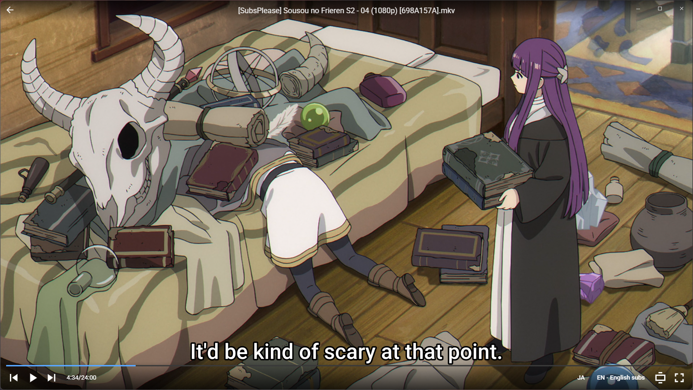

# Anime Player

Anime Player is a Windows desktop app for browsing and playing a local video library. It scans root folders recursively, groups matching filenames into titles and episodes, tracks local watch progress, and plays files through in-process **libmpv** so the UI and video behave like one app window.






## Install and update

These steps are for the pre-built Windows release. To build from source, see [Development: setup](#development-setup) below.

### First-time install

1. Open [GitHub Releases](https://github.com/SirVeggie/anime-player/releases).
2. Download the **versioned zip** `AnimePlayer-vX.X.zip`, **not** the standalone `anime-player.exe`.
   - The zip includes `anime-player.exe`, `libmpv-2.dll`, `update.bat`, and `_update.ps1`. The loose exe on the release page is only for updating an existing install and will not run on its own without the DLL beside it.
3. Extract the folder anywhere you like (the app is portable) and run `anime-player.exe`.
4. Your library database and settings are stored in `data/` next to the executable, so you can move the whole folder later.

WebView2 is required; it is already installed on most current Windows 10/11 systems.

### Updating

1. Close Anime Player completely.
2. In the same folder as `anime-player.exe`, double-click **`update.bat`**.
   - Do not run `_update.ps1` directly; it is only used by `update.bat`.
3. The script downloads the latest `anime-player.exe` from the release (much smaller than re-downloading the zip).

Download the **full zip** again when you are installing on a new PC, or when release notes say the bundled `libmpv-2.dll` changed. App-only updates are enough when only the executable changed.

## Features

- Local library scanner with editable categories, missing-file diagnostics, and regex-based filename detection rules.
- In-process libmpv playback for common containers/codecs including MKV, MP4, HEVC, AV1, FLAC/Opus audio, ASS subtitles, and more.
- Custom player controls for play/pause, seeking, audio/subtitle track selection, aspect fit, fullscreen, and episode navigation.
- Continue Watching, search, bulk category editing, bulk filename replacement, local progress tracking, and optional AniList linking/progress sync.
- Portable local data beside the app executable in `data/anime-player.db`.

Supported video extensions: `mkv`, `mp4`, `m4v`, `mov`, `avi`, `wmv`, `flv`, `webm`, `ts`, `m2ts`, `mts`, `ogv`, `ogm`, `vob`, `3gp`, `rm`, `rmvb`, `mpg`, `mpeg`.

## Basic Usage

1. Open Settings and add one or more root folders.
2. Rescan the library.
3. Open a category, pick a title, then choose an episode to play.
4. Adjust categories, detection rules, bulk edits, and cleanup from Settings/Bulk Edit as needed.

The default detection rules cover common fansub-style names, simple `Title - 01` names, and generic video filenames. Detection rules are evaluated by priority, highest first:

- `Fansub`, priority `10`
- `Fansub (no ep)`, priority `9`
- `Simple`, priority `5`
- `Simple (no ep)`, priority `4`
- `Generic`, priority `0`

## AniList

AniList support is optional. The app includes a default AniList OAuth client ID (`40455`), so most users can open Settings and press **Login with AniList** without changing anything.

If you want to use your own AniList API client, enter its client ID in Settings. Configure the AniList app redirect URL as:

```text
anime-player://anilist-auth
```

After login, you can link local titles to AniList entries, import watched progress, sync completed episodes, and adjust AniList scores from the title page.

## Keybindings

Global:

- `F11`: Toggle app fullscreen, unless typing in a text field.
- `Ctrl+F`: Open/focus Search.
- `Esc`: Go back from category, search, bulk edit, missing, episode, or settings pages.
- `Arrow keys`: Move focus through category/title card grids.

Episode page:

- `Q`: Quick play the current title. It resumes the most recently played episode, advances to the next unwatched episode if that one is watched, or starts the first unwatched episode.

Player:

- `Space`: Play/pause.
- Right click: Play/pause.
- `ArrowLeft` / `ArrowRight`: Seek backward/forward 5 seconds.
- `Numpad4` / `Numpad6`: Seek backward/forward 28 seconds.
- `Numpad7` / `Numpad9`: Seek backward/forward 85 seconds.
- `W` / `S` / mouse wheel: Raise/lower volume by 2 on mpv’s 0–130 scale.
- `M`: Toggle mute.
- `Ctrl+ArrowLeft` / `Ctrl+ArrowRight`: Previous/next episode.
- `F`: Toggle fullscreen.
- `F11`: Toggle app fullscreen.
- `C`: Toggle player controls.
- `Q` or `Esc`: Leave the player and return to the episode list.
- Double left click on the video: Toggle fullscreen.
- Single left click and drag on the video: Drag the window.

libmpv keyboard input is also enabled in the player area, so standard mpv bindings may work in addition to the custom shortcuts above.

## Development: setup

These steps are for building Anime Player from source, not for installing a release download.

Prerequisites:

1. Node.js 18+.
2. Rust stable from <https://rustup.rs>.
3. Microsoft Visual Studio C++ Build Tools with the Desktop development with C++ workload.
4. WebView2 Runtime, which is preinstalled on current Windows 10/11 installs.
5. `7z` on PATH for the mpv setup script.

Install dependencies and download the local libmpv artifacts:

```powershell
npm install
npm run setup:mpv
```

You do not need a separate `mpv.exe` install. The setup script downloads `libmpv-2.dll` and `mpv.lib` into `src-tauri/libs/mpv/`; these generated files are intentionally not committed.

## Development: run and release builds

```powershell
npm run tauri dev
```

The first Rust build can take a few minutes. Later dev runs are much faster.

To build an installer:

```powershell
npm run tauri build
```

To build and package the portable release folder/zip (includes `update.bat` for end users):

```powershell
npm run release
```

When publishing a GitHub release, attach the versioned zip, a standalone `anime-player.exe`, and `anime-player.exe.sha256` (written under `releases/` by the package script).

### Publishing to GitHub

We use a local build + `gh` CLI workflow to publish releases.

**Prerequisites:**
1. Install the [GitHub CLI (`gh`)](https://cli.github.com/).
2. Authenticate: `gh auth login` with `repo` scope.

**Release Workflow (for Agents/Maintainers):**
1. **Build:** Run `npm run release` to build the app and generate the versioned artifacts (`zip`, `exe`, `sha256`) in the `releases/` directory. This also creates a local git tag.
2. **Draft Notes:** Run `npm run release:notes` to generate a draft markdown file (`releases/NOTES-vX.Y.md`) from recent git commits.
3. **Polish Notes:** Open the generated `NOTES-vX.Y.md` file and rewrite the bullet points into user-facing language (group fixes, remove noise).
4. **Publish:** Run `npm run release:publish`. This will push the tag to origin, create the GitHub release using your notes, and upload the three required assets.

*Note for Agents: If you are instructed to create a release, follow the above 4 steps. After running `release:notes`, present the draft to the user or polish the notes file before running `release:publish`.*

## Acknowledgements

Special thanks to [FengZeng/soia](https://github.com/FengZeng/soia) and its author for providing a very helpful reference while working through the Tauri + libmpv integration.

## Development notes

The frontend is React + TypeScript under `src/`. The backend is Rust/Tauri under `src-tauri/`. Playback is handled by libmpv loaded in the Tauri process and rendered into the main window via DirectComposition; see `CONTEXT.md` for the detailed architecture notes.

Useful checks:

```powershell
npx tsc --noEmit
cargo check --manifest-path src-tauri/Cargo.toml
```
